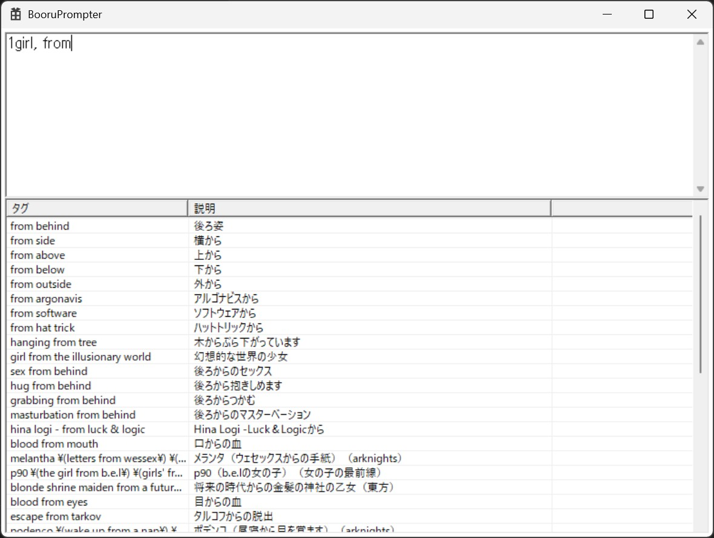

# BooruPrompter

サジェスト機能に特化した画像生成用のプロンプト入力支援ツールです。

各種Web UI系じゃ無理であろう高速なサジェスト機能が欲しかったので……

## 機能

- 入力中タグのサジェストと日本語の意味表示
- スペルが近いタグのサジェスト（少し遅れて表示されるけど充分はやい筈）
- 日本語によるタグの検索（プロンプト欄に日本語を入れると勝手に……）
- (WIP)コピーボタンとか後でつける
- (WIP)サジェストの数を設定できたり窓の位置を記憶したり

## 必要条件
- Windows 10以降

## 使用方法

1. アプリケーションを起動
2. タグ入力欄に文字を入力
3. 候補からタグを選択（ダブルクリックで挿入）
4. プロンプトをコピーして画像生成とかに持っていく（今はボタンとか無いから Ctrl+A→Ctrl+C してね）

## ライセンス

`MIT License`です。詳細は[LICENSE](LICENSE)ファイルを。

## 利用ライブラリ等
- [rapidfuzz-cpp](https://github.com/rapidfuzz/rapidfuzz-cpp) - 高速なあいまい検索ライブラリ
- [booru-japanese-tag](https://github.com/boorutan/booru-japanese-tag) - Danbooruのタグの日本語化プロジェクト

